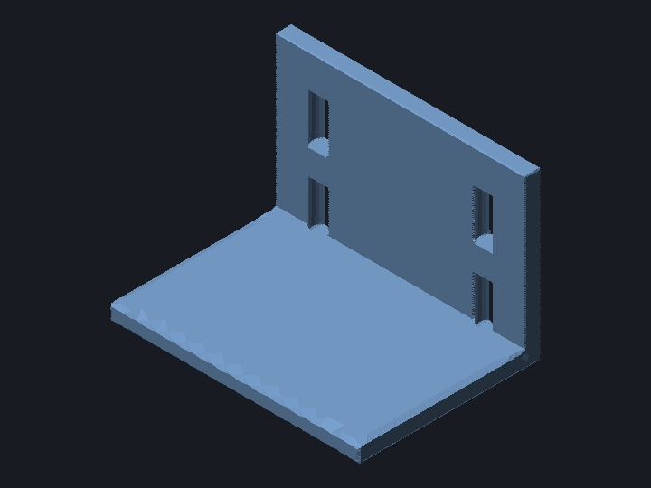

# Agent transcript: a mounting bracket with four holes

An MCP-capable agent turns a one-line spec into a manufacturable part without ever opening a GUI — script, screenshot, measure, export.

Every tool call and result below is **real, unedited output** from the OpenSolid MCP server, captured by [`build-gallery.mjs`](build-gallery.mjs). The agent narration is prose framing; the numbers, renders, and files are the machine’s. Regenerate with `node examples/agent-gallery/build-gallery.mjs`.

> **User:** Design a 90° angle bracket: a 60×40×4 mm base flange with a 60×4×40 mm wall along the back edge, and four Ø6 mm mounting holes in the base. Export STEP and STL and tell me its mass.

---

**Agent:** The kernel centers primitives on the origin and takes half-extents, so a 60×40×4 base is `box3(30, 20, 2)` and the back wall is `box3(30, 2, 20)` stood up along −Y. I’ll union them, then punch four Ø6 (r=3) holes through the base on a rectangular pattern — the pattern is just a JS loop. The one thing to get right: the base is a plate lying in xy with its 4 mm thickness along **z**, so the holes must run along **z** — and `Shape.cylinder` is a **+Y** cylinder, so each one needs `rotate(1, 0, 0, 90)` to swing its axis onto +Z. Skip that and the holes bore lengthwise through the 40 mm width instead, which still reports `valid: true`.

> 🔧 **`create_model`**
> ```js
> // 90° angle bracket: a 60×40×4 horizontal flange and a 60×4×40 vertical
> // flange along the back edge, with four Ø6 mounting holes in the base.
> const base = Shape.box3(30, 20, 2);                        // 60 × 40 × 4
> const wall = Shape.box3(30, 2, 20).translate(0, -18, 22);  // 60 × 4 × 40, back edge
> let bracket = base.union(wall);
> // cylinder() is +Y-axis; the base plate's thickness is along z, so rotate the
> // hole onto +Z before punching it through.
> const hole = Shape.cylinder(3, 6).rotate(1, 0, 0, 90);     // r=3, +Y -> +Z
> for (const x of [-20, 20]) for (const y of [-12, 6]) {
>   bracket = bracket.subtract(hole.translate(x, y, 0));
> }
> return bracket;
> ```
> ```json
> {
>   "model_id": "model-1",
>   "name": "angle-bracket",
>   "exact": false,
>   "mesh": {
>     "triangles": 24188,
>     "vertices": 12088
>   },
>   "boundingBox": {
>     "min": [
>       -30,
>       -20,
>       -2
>     ],
>     "max": [
>       30,
>       20,
>       42
>     ],
>     "size": [
>       60,
>       40,
>       44
>     ]
>   },
>   "volume": 18736.52541076776,
>   "valid": true,
>   "issues": []
> }
> ```

**Agent:** `create_model` returns immediately with `valid: true` and volume 18737 mm³ — the four holes and the boolean union all resolved into one closed solid. Let me eyeball it before exporting.

> 🔧 **`get_screenshot`** `{ "model_id": "model-1", "view": "iso", "width": 720, "height": 540 }`
>
> 
>
> *(real 720×540 render, 17 KB PNG)*

**Agent:** That looks right — but a render cannot tell me a hole went in sideways, and neither can `valid: true`. The only check that can is the volume, against a number I work out by hand: two 60×40×4 plates meeting at a corner is `60*40*4 + 60*4*40 = 19200 mm³`, less four Ø6 holes through 4 mm of base (`4 * π * 3² * 4 = 452.4`) — **18747.6 mm³**.

> 🔧 **`measure`** `{ "model_id": "model-1", "query": "mass" }`
> ```json
> {
>   "volume": 18736.52541076776,
>   "surfaceArea": 10723.762830207674,
>   "centroid": [
>     -0.000020571797553580846,
>     -9.146998505174698,
>     11.26306284369305
>   ],
>   "inertia": [
>     [
>       6345533.795163175,
>       1.9971831435529674,
>       -10.602795309747968
>     ],
>     [
>       1.9971831435529674,
>       9125871.747594982,
>       1868205.04889089
>     ],
>     [
>       -10.602795309747968,
>       1868205.04889089,
>       8360144.591583632
>     ]
>   ],
>   "exact": false
> }
> ```

**Agent:** Volume 18737 mm³ against 18747.6 predicted — -0.1%, which is the SDF mesher reading a hair under true volume at this accuracy, not a modelling error. (Had I left the holes on the default +Y axis they would have bored lengthwise through the plate and landed near 18032 — a 4% miss that looks fine in every render.) So: 18.7 cm³, and in 6061 aluminium (2.70 g/cm³) about **51 g**. Now the files — STL first:

> 🔧 **`export`** `{ "model_id": "model-1", "format": "stl", "path": "angle-bracket.stl" }`
> ```json
> {
>   "model_id": "model-1",
>   "format": "stl",
>   "path": "output/angle-bracket.stl",
>   "bytes": 1209484
> }
> ```

**Agent:** And STEP:

> 🔧 **`export`** `{ "model_id": "model-1", "format": "step", "path": "angle-bracket.step" }`
> ```json
> {
>   "model_id": "model-1",
>   "format": "step",
>   "path": "output/angle-bracket.step",
>   "bytes": 8476931
> }
> ```

**Agent:** Both files wrote. This shape has no exact B-Rep companion, so STEP goes through the faceted SDF→B-Rep path: the exporter meshes the solid to a closed manifold and emits that as a B-rep body. That path needs a watertight mesh, and it used to not get one here — the mesher fused two surface sheets through a single cell into a *pinched* edge (the defect tracked as of-o0o) and STEP declined rather than write a corrupt file. A later mesher fix (of-obv) cleared the pinch for this geometry, so the closed mesh now survives the conversion and STEP exports. The STL takes a separate, mesh-direct path and was never affected either way.

**Agent:** One thing to carry forward: this is a *faceted* STEP — the round hole walls arrive as many small planar facets, not analytic cylinders, which is why the file is large. When an exact B-Rep matters (crisp analytic faces, a smaller file), model the L-section as an extruded `Profile` instead, the way the [right-angle bracket](bracket-right-angle.md) transcript builds it. Same part, different construction, different export path.
