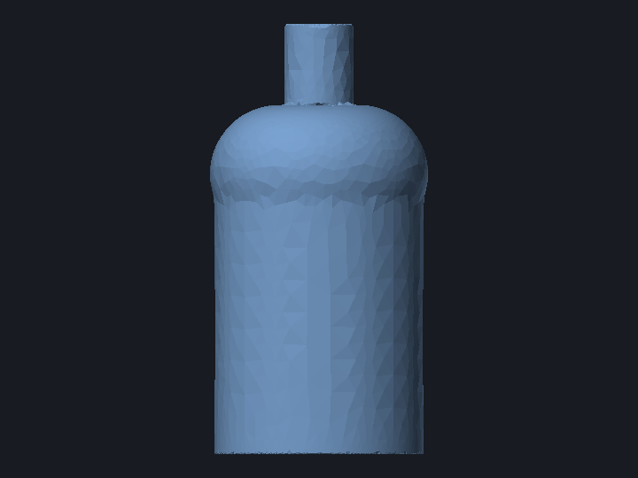
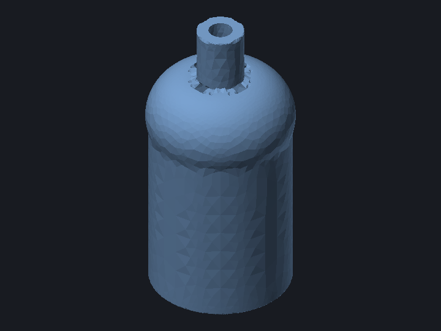

# Agent transcript: a bottle from a revolved, shelled profile

The classic OpenCascade "bottle", built the OpenSolid way: revolve a 2D silhouette 360°, then hollow it by subtracting an inner revolve that breaks through the top. A rounded shoulder comes from an `arcTo` fillet.

Every tool call and result below is **real, unedited output** from the OpenSolid MCP server, captured by [`build-gallery.mjs`](build-gallery.mjs). The agent narration is prose framing; the numbers, renders, and files are the machine’s. Regenerate with `node examples/agent-gallery/build-gallery.mjs`.

> **User:** Build a bottle: revolve a silhouette into a body with a rounded shoulder and a neck, then hollow it out so the mouth is open. Validate it’s watertight and give me an STL and an OBJ.

---

**Agent:** A `Profile` is a closed polyline with optional arcs. I draw the outer silhouette — straight up the body, an `arcTo` for the rounded shoulder, up the neck — revolve it about Y, then subtract a slightly-smaller inner revolve that runs taller than the neck so it opens the mouth. That inner subtract is the shell.

> 🔧 **`create_model`**
> ```js
> // A bottle: revolve a 2D silhouette 360° about the Y axis, then hollow it by
> // subtracting an inner revolve that breaks through the top (the shell). The
> // arcTo on the shoulder is a rounded fillet from body to neck.
> const outer = new Profile(0, 0);
> outer.lineTo(18, 0);
> outer.lineTo(18, 44);
> outer.arcTo(6, 60, 0.55);     // rounded shoulder (fillet), body -> neck
> outer.lineTo(6, 74);
> outer.lineTo(0, 74);
> outer.close();
> let bottle = Shape.revolve(outer, 360);
> 
> const cavity = new Profile(0, 3);
> cavity.lineTo(15, 3);
> cavity.lineTo(15, 44);
> cavity.arcTo(3, 60, 0.55);
> cavity.lineTo(3, 90);         // taller than the neck: opens the mouth
> cavity.lineTo(0, 90);
> cavity.close();
> return bottle.subtract(Shape.revolve(cavity, 360));
> ```
> ```json
> {
>   "model_id": "model-6",
>   "name": "bottle",
>   "exact": false,
>   "mesh": {
>     "triangles": 23388,
>     "vertices": 11688
>   },
>   "boundingBox": {
>     "min": [
>       -18.768181818181816,
>       0,
>       -18.768181818181816
>     ],
>     "max": [
>       18.768181818181816,
>       74,
>       18.768181818181816
>     ],
>     "size": [
>       37.53636363636363,
>       74,
>       37.53636363636363
>     ]
>   },
>   "volume": 21531.303576462276,
>   "valid": true,
>   "issues": []
> }
> ```

**Agent:** Rendering the result from the front and iso to check the silhouette and the open neck:

> 🔧 **`get_screenshot`** `{ "model_id": "model-6", "view": "front", "width": 720, "height": 540 }`
>
> 
>
> *(real 720×540 render, 35 KB PNG)*

> 🔧 **`get_screenshot`** `{ "model_id": "model-6", "view": "iso", "width": 720, "height": 540 }`
>
> 
>
> *(real 720×540 render, 42 KB PNG)*

**Agent:** Now the watertightness check — a shell that didn’t break through would read as a closed cavity:

> 🔧 **`validate`** `{ "model_id": "model-6" }`
> ```json
> {
>   "valid": true,
>   "closedManifold": true,
>   "triangles": 23388,
>   "vertices": 11688,
>   "volume": 21531.303576462276,
>   "exact": false,
>   "issues": []
> }
> ```

**Agent:** `closedManifold: true`, volume 21531 mm³ — a genuine hollow solid with an open mouth. Exporting mesh formats:

> 🔧 **`export`** `{ "model_id": "model-6", "format": "stl", "path": "bottle.stl" }`
> ```json
> {
>   "model_id": "model-6",
>   "format": "stl",
>   "path": "output/bottle.stl",
>   "bytes": 1169484
> }
> ```

> 🔧 **`export`** `{ "model_id": "model-6", "format": "obj", "path": "bottle.obj" }`
> ```json
> {
>   "model_id": "model-6",
>   "format": "obj",
>   "path": "output/bottle.obj",
>   "bytes": 1985008
> }
> ```

**Agent:** A hollow bottle with a rounded shoulder and an open neck, watertight where it should be and open where it should be — all from a revolved profile and one boolean subtract.
