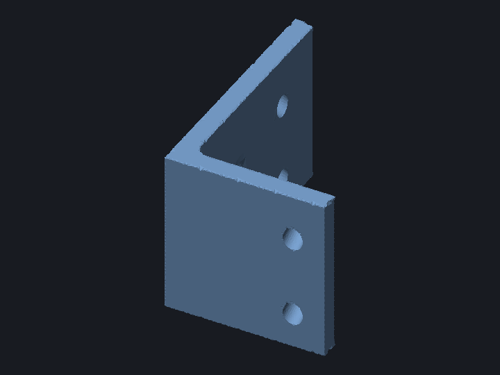
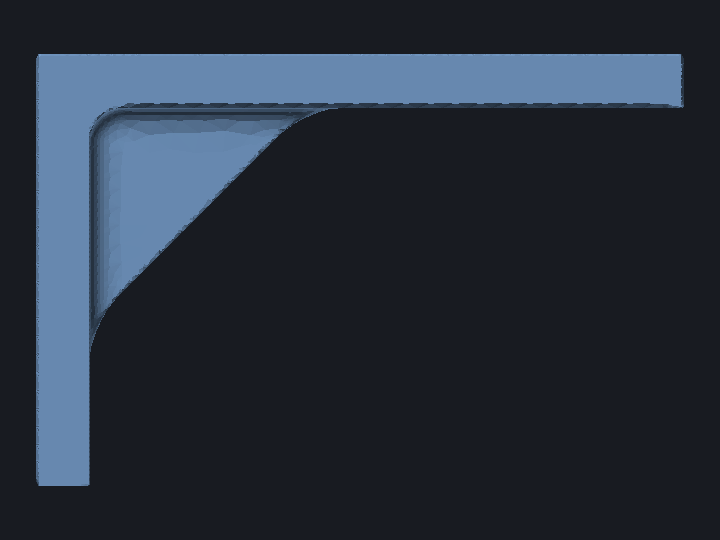
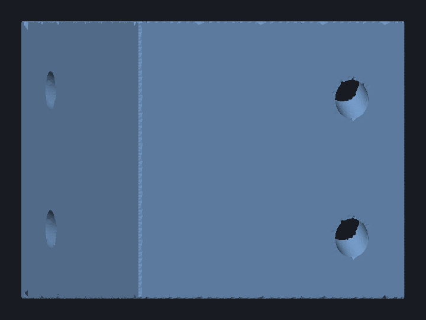

# Agent transcript: a right-angle bracket with a gusset and filleted corner

The acceptance part: a real engineering bracket with a load-bearing gusset, a filleted interior corner, and four tapped-size mounting holes. It exercises profiles, extrusion, blends, and drilling on three different axes — and it surfaces two kernel behaviours an agent must know about, both kept verbatim below.

Every tool call and result below is **real, unedited output** from the OpenSolid MCP server, captured by [`build-gallery.mjs`](build-gallery.mjs). The agent narration is prose framing; the numbers, renders, and files are the machine’s. Regenerate with `node examples/agent-gallery/build-gallery.mjs`.

> **User:** Design a right-angle bracket: a 60×40×5 mm base plate, a 40×40×5 mm vertical plate, a triangular gusset between them, 4× M5 mounting holes (2 per plate), and 3 mm fillets on the interior corner and the gusset edges. Verify it and export a STEP file.

---

**Agent:** Two kernel facts drive the whole script. First, the extrusion axis is **+Y**, not +Z: `Shape.extrude` sweeps a profile’s `(u, v)` into `(x, z)` and pushes it along +Y (`bounded.rs`), and `Shape.cylinder` is likewise a **+Y**-axis cylinder — radial in xz, axial in y (`primitives.rs`). Second, that makes the L-section a *profile* problem: I can draw the whole cross-section in (x, z) — including the 3 mm interior fillet as a real arc — and sweep it 40 mm along +Y for the width. `arcTo`’s bulge is the DXF convention, `tan(sweep/4)`, so a 90° arc is `tan(22.5°) = 0.4142`; negative sweeps it clockwise, which is the concave direction here.

**Agent:** That leaves the part **z-up**: x is its 60 mm length, y its 40 mm width, z its 40 mm height. I am keeping it that way deliberately — STEP, FreeCAD, and CAD interchange generally are z-up, and the STEP writer emits coordinates verbatim, so a z-up model lands upright in FreeCAD. Be aware this cuts against the *renderer*, whose named views assume y is up (`render.js`). So for this part `top` (looking down −Y) is the view that shows the L-section, and `front` (looking down −Z) is the plan view of the base plate. The view names are worth reading literally, not geometrically.

> 🔧 **`create_model`**
> ```js
> // Right-angle bracket: 60×40×5 base plate, 40×40×5 vertical plate, triangular
> // gusset, 4× M5 clearance holes, 3 mm fillets on the interior corner and gusset.
> //
> // extrude() sweeps a profile along +Y, mapping profile (u,v) -> (x,z). So the
> // L cross-section is drawn in (x, z) and swept 40 mm for the bracket's width.
> const B = 0.41421356237309503;          // tan(90°/4): a 90° arc, DXF bulge
> const p = new Profile(-30, 0);          // base underside, at the wall end
> p.lineTo(30, 0);                        // base plate, 60 long
> p.lineTo(30, 5);                        // base plate, 5 thick
> p.lineTo(-22, 5);                       // top of base, out to the fillet tangent
> p.arcTo(-25, 8, -B);                    // 3 mm fillet on the interior corner
> p.lineTo(-25, 40);                      // wall inner face, 40 tall
> p.lineTo(-30, 40);                      // wall top, 5 thick
> p.close();
> const ell = Shape.extrude(p, 40);       // sweep +Y: the 40 mm width
> 
> // Triangular gusset: 20 mm legs, 5 mm thick, centered across the width.
> const t = new Profile(-25, 5);
> t.lineTo(-5, 5);
> t.lineTo(-25, 25);
> t.close();
> const gusset = Shape.extrude(t, 5).translate(0, 17.5, 0);
> 
> // smoothUnion blends the gusset into both plates: the 3 mm gusset fillets.
> let part = ell.smoothUnion(gusset, 3);
> 
> // 4× M5 clearance holes (Ø5). cylinder() is +Y-axis, so rotate it onto the
> // drilling axis: +Z for the base plate, +X for the vertical plate.
> const zHole = Shape.cylinder(2.5, 10).rotate(1, 0, 0, 90);   // -> +Z
> for (const y of [10, 30]) part = part.subtract(zHole.translate(15, y, 0));
> const xHole = Shape.cylinder(2.5, 10).rotate(0, 0, 1, 90);   // -> +X
> for (const y of [10, 30]) part = part.subtract(xHole.translate(-27.5, y, 32));
> return part;
> ```
> ```json
> {
>   "model_id": "model-7",
>   "name": "bracket-right-angle",
>   "exact": false,
>   "mesh": {
>     "triangles": 28796,
>     "vertices": 14392
>   },
>   "boundingBox": {
>     "min": [
>       -30.000000000000167,
>       -1.7015596003106645e-15,
>       -2.5604518505418055e-10
>     ],
>     "max": [
>       30,
>       40,
>       40
>     ],
>     "size": [
>       60.00000000000017,
>       40,
>       40.000000000256044
>     ]
>   },
>   "volume": 19786.79765644562,
>   "valid": true,
>   "issues": [],
>   "mesher": "adaptive-sdf",
>   "brepChecked": false
> }
> ```

**Agent:** `valid: true`, volume 19787 mm³. That is the oracle that matters: hand-integrating the section gives 19792 mm³ (19077 for the filleted L, +1000 gusset, +blend, −393 for four Ø5 holes through 5 mm), so the mesh is reading well under 0.1% off — the same small bias a plain 60×40×5 slab shows (11996 vs 12000). The holes are real: drop them and the body measures 20177 mm³. Let me look at it from three sides before exporting.

> 🔧 **`get_screenshot`** `{ "model_id": "model-7", "view": "iso", "width": 720, "height": 540 }`
>
> 
>
> *(real 720×540 render, 32 KB PNG)*

> 🔧 **`get_screenshot`** `{ "model_id": "model-7", "view": "top", "width": 720, "height": 540 }`
>
> 
>
> *(real 720×540 render, 17 KB PNG)*

> 🔧 **`get_screenshot`** `{ "model_id": "model-7", "view": "front", "width": 720, "height": 540 }`
>
> 
>
> *(real 720×540 render, 29 KB PNG)*

**Agent:** The `top` render is the elevation that matters: the L-section with the 3 mm fillet blended into the interior corner and the gusset filling the angle. `front` is the plan view of the base plate with its two M5 holes, and the iso ties it together. Mass properties:

> 🔧 **`measure`** `{ "model_id": "model-7", "query": "mass" }`
> ```json
> {
>   "volume": 19786.79765644562,
>   "surfaceArea": 9221.085221281435,
>   "centroid": [
>     -10.742706235801062,
>     20.000016553543194,
>     9.808830414815995
>   ],
>   "inertia": [
>     [
>       4926679.008941298,
>       40.11055980809033,
>       2343981.4189155716
>     ],
>     [
>       40.11055980809033,
>       9299727.545560187,
>       -80.87396221142262
>     ],
>     [
>       2343981.4189155716,
>       -80.87396221142262,
>       9366653.418768229
>     ]
>   ],
>   "exact": false
> }
> ```

**Agent:** Volume 19787 mm³ = 19.8 cm³; in 6061 aluminium (2.70 g/cm³) that is about **53 g**. The reported `boundingBox` measures the part itself (it is taken off the same mesh these mass properties integrate), so it is good to the meshing accuracy and can be read as a measurement.

Before exporting, though, a volume is a weak oracle for a part like this. Four Ø5 holes bored the *wrong* way through these plates remove nearly the right amount of material, render plausibly, and still report `valid: true` — that is a bug this part actually shipped with once. So I will ask about the structure directly, not the scalars:

> 🔧 **`inspect_topology`**
> ```json
> {
>   "model_id": "model-7",
>   "include_faces": false
> }
> ```
> ```json
> {
>   "model_id": "model-7",
>   "counts": {
>     "planarFaces": 11,
>     "circularRims": 8,
>     "throughHoles": 4,
>     "pockets": 0,
>     "cavities": 0,
>     "bosses": 0,
>     "unpairedRims": 0,
>     "shells": 1,
>     "genus": 4
>   },
>   "mesh": {
>     "components": 1,
>     "vertices": 14392,
>     "edges": 43194,
>     "triangles": 28796,
>     "eulerCharacteristic": -6,
>     "genus": 4,
>     "closed": true
>   },
>   "cylinders": [
>     {
>       "kind": "through-hole",
>       "axis": [
>         0.0001851866783509887,
>         -0.000020362539085941532,
>         0.9999999826456304
>       ],
>       "radius": 2.5008861654446406,
>       "diameter": 5.001772330889281,
>       "center": [
>         14.99985070653431,
>         10.000325632925215,
>         2.453933957939784
>       ],
>       "ends": [
>         [
>           14.999397940176744,
>           10.00037541767612,
>           0.009015383115880831
>         ],
>         [
>           15.00030347289188,
>           10.000275848174308,
>           4.898852532763687
>         ]
>       ],
>       "depth": 4.889837234507849
>     },
>     {
>       "kind": "through-hole",
>       "axis": [
>         -0.00003511599840040121,
>         -0.0000019641007542183265,
>         0.9999999993815045
>       ],
>       "radius": 2.500755790782285,
>       "diameter": 5.00151158156457,
>       "center": [
>         15.000357427236448,
>         29.9997141689513,
>         2.454844603787395
>       ],
>       "ends": [
>         [
>           15.000443349673766,
>           29.999718974747278,
>           0.008027165048380908
>         ],
>         [
>           15.00027150479913,
>           29.99970936315532,
>           4.90166204252641
>         ]
>       ],
>       "depth": 4.89363488050472
>     },
>     {
>       "kind": "through-hole",
>       "axis": [
>         0.9999999496592932,
>         -0.00031701248536326204,
>         -0.000013582910102976422
>       ],
>       "radius": 2.500575626491806,
>       "diameter": 5.001151252983612,
>       "center": [
>         -27.501180219927477,
>         9.999119380354962,
>         32.000029501570516
>       ],
>       "ends": [
>         [
>           -29.98292362813131,
>           9.999906124040436,
>           32.000063210869826
>         ],
>         [
>           -25.019436811723644,
>           9.998332636669488,
>           31.999995792271207
>         ]
>       ],
>       "depth": 4.963487066273114
>     },
>     {
>       "kind": "through-hole",
>       "axis": [
>         0.9999999539044516,
>         0.0003030119374527411,
>         -0.00001936130565446517
>       ],
>       "radius": 2.5005539153409373,
>       "diameter": 5.001107830681875,
>       "center": [
>         -27.49649140683647,
>         30.000843577701062,
>         32.00001017878982
>       ],
>       "ends": [
>         [
>           -29.981875912627988,
>           30.000090476491934,
>           32.000058299081125
>         ],
>         [
>           -25.011106901044947,
>           30.001596678910193,
>           31.999962058498518
>         ]
>       ],
>       "depth": 4.970769240713375
>     }
>   ],
>   "planarFaces": {
>     "count": 11,
>     "totalArea": 9221.085273841834,
>     "planarAreaFraction": 0.869784324096345,
>     "remainderArea": 1200.7298514985541
>   },
>   "brep": {
>     "available": false,
>     "reason": "this shape has no exact B-Rep companion: an op in its chain is outside exact coverage (smooth blends, rounded boxes, sweeps/lofts/ribs, offsets, shells, anisotropic scale), or a boolean gated back to the F-Rep path. Only the mesh oracles (validate, measure, meshAgreement) apply."
>   }
> }
> ```

**Agent:** `genus: 4` — four handles in the surface, which is four holes going *through* the part; that number comes from `V − E + F` over the mesh, so it is combinatorics and cannot drift with meshing accuracy. `shells: 1`, so nothing was severed. And each bore is listed with the axis it was actually drilled on: two along Z through the base plate, two along X through the wall, all Ø5.00 through 4.9 mm of plate. That is the check no screenshot and no volume can make.

Now the whole spec at once, as expectations rather than numbers I have to eyeball:

> 🔧 **`assert_model`**
> ```json
> {
>   "model_id": "model-7",
>   "expect": [
>     {
>       "type": "closed_solid"
>     },
>     {
>       "type": "shells",
>       "value": 1
>     },
>     {
>       "type": "genus",
>       "value": 4
>     },
>     {
>       "type": "volume",
>       "value": 19792,
>       "relative_tolerance": 0.01
>     },
>     {
>       "type": "bbox_size",
>       "value": [
>         60,
>         40,
>         40
>       ],
>       "tolerance": 0.5
>     },
>     {
>       "type": "through_holes",
>       "value": 2,
>       "axis": [
>         0,
>         0,
>         1
>       ],
>       "diameter": 5,
>       "tolerance": 0.3
>     },
>     {
>       "type": "through_holes",
>       "value": 2,
>       "axis": [
>         1,
>         0,
>         0
>       ],
>       "diameter": 5,
>       "tolerance": 0.3
>     },
>     {
>       "type": "hole_at",
>       "at": [
>         15,
>         10,
>         2.5
>       ],
>       "axis": [
>         0,
>         0,
>         1
>       ],
>       "diameter": 5,
>       "tolerance": 0.3
>     }
>   ]
> }
> ```
> ```json
> {
>   "model_id": "model-7",
>   "ok": true,
>   "passed": 8,
>   "failed": 0,
>   "checks": [
>     {
>       "type": "closed_solid",
>       "ok": true,
>       "expected": true,
>       "actual": true,
>       "message": "closed, consistently oriented solid"
>     },
>     {
>       "type": "shells",
>       "ok": true,
>       "expected": 1,
>       "actual": 1,
>       "message": "1 disconnected shells, as expected"
>     },
>     {
>       "type": "genus",
>       "ok": true,
>       "expected": 4,
>       "actual": 4,
>       "message": "4 handles (through-holes) in the surface, as expected"
>     },
>     {
>       "type": "volume",
>       "ok": true,
>       "expected": 19792,
>       "actual": 19786.79765644562,
>       "message": "volume 19786.79765644562 is within 197.92000000000002 of 19792"
>     },
>     {
>       "type": "bbox_size",
>       "ok": true,
>       "expected": [
>         60,
>         40,
>         40
>       ],
>       "actual": [
>         60.00000000000017,
>         40,
>         40.000000000256044
>       ],
>       "message": "bbox_size matches"
>     },
>     {
>       "type": "through_holes",
>       "ok": true,
>       "expected": 2,
>       "actual": 2,
>       "message": "2 through-holes matching axis ≈ [0.000,0.000,1.000], Ø5 ±0.3, as expected"
>     },
>     {
>       "type": "through_holes",
>       "ok": true,
>       "expected": 2,
>       "actual": 2,
>       "message": "2 through-holes matching axis ≈ [1.000,0.000,0.000], Ø5 ±0.3, as expected"
>     },
>     {
>       "type": "hole_at",
>       "ok": true,
>       "expected": 5,
>       "actual": 5.000000000000016,
>       "message": "bore present, 5.000000000000016 across"
>     }
>   ]
> }
> ```

**Agent:** `8/8` — the part meets its spec, including the two assertions that name the drilling axes. Mutate the `rotate` calls in the script and those two fail while `closed_solid` keeps passing, which is exactly the failure mode. Exporting:

> 🔧 **`export`** `{ "model_id": "model-7", "format": "step", "path": "bracket-right-angle.step" }`
> ```json
> {
>   "model_id": "model-7",
>   "format": "step",
>   "path": "output/bracket-right-angle.step",
>   "bytes": 11887644,
>   "unit": "mm"
> }
> ```

> 🔧 **`export`** `{ "model_id": "model-7", "format": "stl", "path": "bracket-right-angle.stl" }`
> ```json
> {
>   "model_id": "model-7",
>   "format": "stl",
>   "path": "output/bracket-right-angle.stl",
>   "bytes": 1439884
> }
> ```

**Agent:** A valid, watertight right-angle bracket — gusset blended, corner filleted, four M5 holes drilled on two axes — as a faceted STEP and a print-ready STL. Two caveats an agent should carry forward. The **+Y** axis convention for `extrude`/`cylinder`: get it wrong and a hole silently becomes a channel through the part, with no error and a `valid: true` mesh — the volume delta is the only thing that catches it, which is why measuring against a hand-computed number is not optional here. And the view names: a z-up part makes the renderer’s `top` the section elevation and `front` the plan — read them literally, not geometrically. One retired caveat, for readers of older versions of this script: the part used to need a trailing no-op `rotate(0, 1, 0, 360)` to mesh closed at all — without it the mesh came back open and STEP declined, a bounds-alignment mesher defect tracked as of-obv. That fix landed; the workaround is gone and the part meshes closed as written.
