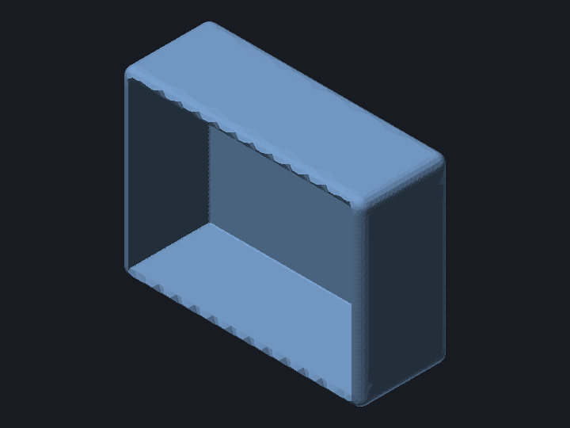
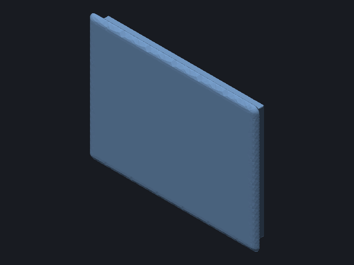

# Agent transcript: a shelled enclosure with a press-fit lid

A two-part build: a hollow electronics enclosure with an open top, plus a matching lid that press-fits into its mouth. Shelling is `outer.subtract(inner)`.

Every tool call and result below is **real, unedited output** from the OpenSolid MCP server, captured by [`build-gallery.mjs`](build-gallery.mjs). The agent narration is prose framing; the numbers, renders, and files are the machine’s. Regenerate with `node examples/agent-gallery/build-gallery.mjs`.

> **User:** I need an 80×60×30 mm electronics enclosure with 3 mm walls, open on top, plus a lid that press-fits into it. Rounded corners. Give me both as STEP and STL.

---

**Agent:** I’ll shell the body by subtracting an inner cavity from a rounded box, raising the cavity so it breaks through the top face — that leaves the box open for the lid. Then a separate lid with a recessed lip sized for a press fit.

> 🔧 **`create_model`**
> ```js
> // Electronics enclosure: a rounded box hollowed to a 3 mm wall with an open
> // top. The shell is outer.subtract(inner) — the inner cavity is raised so it
> // breaks through the top face, leaving the box open for the lid.
> const outer = Shape.roundedBox(40, 30, 15, 3);                 // 80 × 60 × 30
> const cavity = Shape.box3(37, 27, 14).translate(0, 0, 2);      // 3 mm walls, open top
> return outer.subtract(cavity);
> ```
> ```json
> {
>   "model_id": "model-3",
>   "name": "enclosure-body",
>   "exact": false,
>   "mesh": {
>     "triangles": 29596,
>     "vertices": 14800
>   },
>   "boundingBox": {
>     "min": [
>       -40,
>       -30,
>       -15
>     ],
>     "max": [
>       40,
>       30,
>       15
>     ],
>     "size": [
>       80,
>       60,
>       30
>     ]
>   },
>   "volume": 34763.23671539217,
>   "valid": true,
>   "issues": []
> }
> ```

**Agent:** Body is valid — volume 34763 mm³ after hollowing. Rendering it to check the wall broke through the top:

> 🔧 **`get_screenshot`** `{ "model_id": "model-3", "view": "iso", "width": 720, "height": 540 }`
>
> 
>
> *(real 720×540 render, 23 KB PNG)*

> 🔧 **`export`** `{ "model_id": "model-3", "format": "step", "path": "enclosure-body.step" }`
> ```json
> {
>   "model_id": "model-3",
>   "format": "step",
>   "path": "output/enclosure-body.step",
>   "bytes": 5924702
> }
> ```

> 🔧 **`export`** `{ "model_id": "model-3", "format": "stl", "path": "enclosure-body.stl" }`
> ```json
> {
>   "model_id": "model-3",
>   "format": "stl",
>   "path": "output/enclosure-body.stl",
>   "bytes": 1479884
> }
> ```

**Agent:** Open-topped shell, confirmed. Now the lid: a top plate with a lip that drops into the mouth with 0.5 mm clearance per wall.

> 🔧 **`create_model`**
> ```js
> // Matching lid: a top plate with a recessed lip that press-fits into the
> // enclosure's open mouth (0.5 mm clearance on each wall).
> const cap = Shape.roundedBox(40, 30, 1.5, 3).translate(0, 0, 16.5);  // top plate
> const lip = Shape.box3(36.5, 26.5, 2).translate(0, 0, 13);           // insert lip
> return cap.union(lip);
> ```
> ```json
> {
>   "model_id": "model-4",
>   "name": "enclosure-lid",
>   "exact": false,
>   "mesh": {
>     "triangles": 17284,
>     "vertices": 8644
>   },
>   "boundingBox": {
>     "min": [
>       -40,
>       -30,
>       11
>     ],
>     "max": [
>       40,
>       30,
>       18
>     ],
>     "size": [
>       80,
>       60,
>       7
>     ]
>   },
>   "volume": 28883.29791850566,
>   "valid": true,
>   "issues": []
> }
> ```

> 🔧 **`get_screenshot`** `{ "model_id": "model-4", "view": "iso", "width": 720, "height": 540 }`
>
> 
>
> *(real 720×540 render, 17 KB PNG)*

> 🔧 **`export`** `{ "model_id": "model-4", "format": "step", "path": "enclosure-lid.step" }`
> ```json
> {
>   "model_id": "model-4",
>   "format": "step",
>   "path": "output/enclosure-lid.step",
>   "bytes": 4721868
> }
> ```

> 🔧 **`export`** `{ "model_id": "model-4", "format": "stl", "path": "enclosure-lid.stl" }`
> ```json
> {
>   "model_id": "model-4",
>   "format": "stl",
>   "path": "output/enclosure-lid.stl",
>   "bytes": 864284
> }
> ```

**Agent:** Two parts, both watertight: an open-topped 3 mm-walled enclosure and a press-fit lid, each as STEP and STL. The lip is 0.5 mm under the cavity on every wall, so it seats without jamming.
