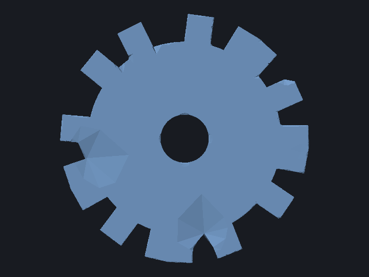
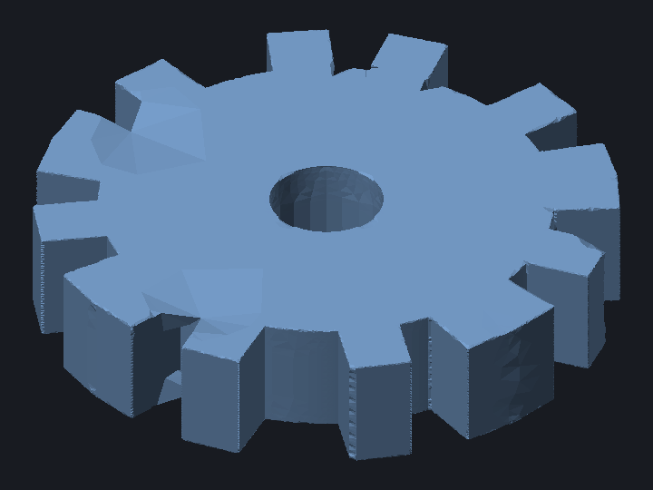

# Agent transcript: a toothed disk from a circular pattern

The script vocabulary is a real programming language, so a circular pattern is just a `for` loop rotating one feature around the axis. This one also surfaces a genuine export limitation — and how the tool reports it.

Every tool call and result below is **real, unedited output** from the OpenSolid MCP server, captured by [`build-gallery.mjs`](build-gallery.mjs). The agent narration is prose framing; the numbers, renders, and files are the machine’s. Regenerate with `node examples/agent-gallery/build-gallery.mjs`.

> **User:** Make a 16-tooth spur-gear-style disk: a root disk with rectangular teeth on a circular pattern and a central bore. Top and iso views, and an STL for printing.

---

**Agent:** One tooth box, rotated into 16 positions by a loop, unioned onto a root cylinder, minus a central bore. `(360 * i) / TEETH` spaces the teeth evenly.

> 🔧 **`create_model`**
> ```js
> // A toothed disk: a root disk with N teeth placed on a circular pattern by
> // rotating one tooth box around the Z axis, plus a central bore. The pattern
> // is just a JS loop — the script vocabulary is a real programming language.
> const TEETH = 16, TH = 4, ROOT = 16, BORE = 4;
> let gear = Shape.cylinder(ROOT, TH);
> const tooth = Shape.box3(3, 2.2, TH).translate(ROOT + 1.5, 0, 0);
> for (let i = 0; i < TEETH; i++) {
>   gear = gear.union(tooth.rotate(0, 0, 1, (360 * i) / TEETH));
> }
> return gear.subtract(Shape.cylinder(BORE, TH + 2));           // central bore
> ```
> ```json
> {
>   "model_id": "model-5",
>   "name": "gear-disk",
>   "exact": false,
>   "mesh": {
>     "triangles": 50928,
>     "vertices": 25478
>   },
>   "boundingBox": {
>     "min": [
>       -20.614211729823097,
>       -20.577241106166063,
>       -16
>     ],
>     "max": [
>       20.567131070203015,
>       20.61083951798434,
>       16
>     ],
>     "size": [
>       41.181342800026115,
>       41.1880806241504,
>       32
>     ]
>   },
>   "volume": 8999.588002223581,
>   "valid": true,
>   "issues": []
> }
> ```

**Agent:** All 16 teeth resolved — `valid: true`, volume 9000 mm³. Top view to check the tooth count and spacing, then iso:

> 🔧 **`get_screenshot`** `{ "model_id": "model-5", "view": "top", "width": 720, "height": 540 }`
>
> 
>
> *(real 720×540 render, 26 KB PNG)*

> 🔧 **`get_screenshot`** `{ "model_id": "model-5", "view": "iso", "width": 720, "height": 540 }`
>
> 
>
> *(real 720×540 render, 36 KB PNG)*

**Agent:** Sixteen evenly-spaced teeth. STL exports the mesh directly:

> 🔧 **`export`** `{ "model_id": "model-5", "format": "stl", "path": "gear-disk.stl" }`
> ```json
> {
>   "model_id": "model-5",
>   "format": "stl",
>   "path": "output/gear-disk.stl",
>   "bytes": 2546484
> }
> ```

**Agent:** For completeness I’ll also try STEP. The thin teeth sit right at the edge of the model’s bounding box, and the faceted STEP path needs the surface strictly *inside* the meshing region — so this is a case where the export declines rather than emitting a broken file. Watch how it reports:

> 🔧 **`export`** `{ "model_id": "model-5", "format": "step", "path": "gear-disk.step" }`
> ```json
> {
>   "isError": true,
>   "text": "Error: export failed: STEP export failed: degenerate geometry in sdf_to_brep: adaptive meshing did not produce a closed manifold; the surface must lie strictly inside the meshing bounds"
> }
> ```

**Agent:** That’s the honest failure mode: `isError: true` with a specific reason, not a silently-corrupt STEP. The STL is unaffected — meshing and STEP’s planar-region recovery are different code paths. For an analytic STEP of a gear you’d thicken the teeth slightly or model them as an extruded `Profile`; the STL here is already print-ready.
