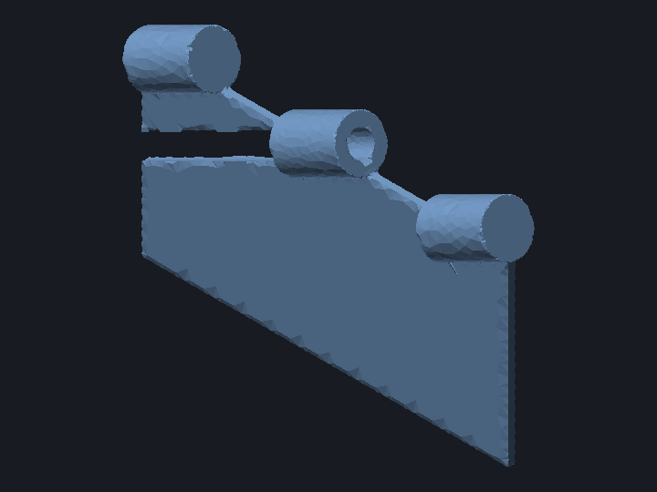

# Agent transcript: a hinge leaf with knuckles and a pin bore

Rotations put a cylinder’s axis wherever you want it. Here the agent builds one leaf of a butt hinge — barrel knuckles on the pin axis, drilled through for the pin.

Every tool call and result below is **real, unedited output** from the OpenSolid MCP server, captured by [`build-gallery.mjs`](build-gallery.mjs). The agent narration is prose framing; the numbers, renders, and files are the machine’s. Regenerate with `node examples/agent-gallery/build-gallery.mjs`.

> **User:** Model one leaf of a butt hinge: a flat plate with three barrel knuckles on the pin axis and a pin bore drilled through them. Show me an iso view and give me a STEP file.

---

**Agent:** A knuckle is a cylinder whose default **+Y** axis I rotate onto +X, then slide along X. Three of them union onto the plate; a long thin cylinder on the same axis subtracts the pin bore. The rotation to reach for is `rotate(0, 0, 1, 90)` — turning about **Z** is what carries +Y onto X. Rotating about Y, which is the tempting one to write, would spin the cylinder about its own axis and change nothing.

> 🔧 **`create_model`**
> ```js
> // One leaf of a butt hinge: a flat plate with three barrel knuckles on the
> // pin axis (X) and a pin bore drilled through them. Two of these — one
> // mirrored — pin together into a working hinge.
> const plate = Shape.box3(30, 15, 0.75).translate(0, -15.75, 0);  // 60 × 30 × 1.5 leaf
> // cylinder() is +Y-axis. Rotating about Z carries it onto X (rotating about Y
> // would be a no-op — it is already on Y).
> const knuckle = Shape.cylinder(4, 6).rotate(0, 0, 1, 90);        // r=4, 12 long on X
> let leaf = plate;
> for (const x of [-24, 0, 24]) leaf = leaf.union(knuckle.translate(x, 0, 0));
> const pin = Shape.cylinder(2, 40).rotate(0, 0, 1, 90);           // Ø4 bore on X
> return leaf.subtract(pin);
> ```
> ```json
> {
>   "model_id": "model-2",
>   "name": "hinge-leaf",
>   "exact": false,
>   "mesh": {
>     "triangles": 31292,
>     "vertices": 15642
>   },
>   "boundingBox": {
>     "min": [
>       -30,
>       -30.75,
>       -3.9999607582315595
>     ],
>     "max": [
>       30,
>       3.999932899561649,
>       3.999962822786223
>     ],
>     "size": [
>       60,
>       34.74993289956165,
>       7.999923581017782
>     ]
>   },
>   "volume": 3815.201362779873,
>   "valid": true,
>   "issues": []
> }
> ```

**Agent:** Valid solid, 31,292 triangles — the pin bore runs cleanly through all three knuckles. One historical note, because this transcript used to carry a warning here: earlier kernel versions *pinched* the mesh at several bore diameters — Ø2.4, Ø3.2 and Ø7 all came back `valid: false` with two surface sheets fused through one octree cell where the bore runs near-tangent, the mesher defect tracked as of-o0o — so Ø4 was originally a workaround found by trial. The mesher fixes (of-obv, of-o0o) cleared that: every bore size I retried now meshes closed, Ø2.4 through Ø7. Ø4 stays because it is a sensible pin for a 1.5 mm leaf, not because the mesher demands it. Let me confirm the mesh is watertight before exporting.

> 🔧 **`get_screenshot`** `{ "model_id": "model-2", "view": "iso", "width": 720, "height": 540 }`
>
> 
>
> *(real 720×540 render, 27 KB PNG)*

> 🔧 **`validate`** `{ "model_id": "model-2" }`
> ```json
> {
>   "valid": true,
>   "closedManifold": true,
>   "triangles": 31292,
>   "vertices": 15642,
>   "volume": 3815.201362779873,
>   "exact": false,
>   "issues": []
> }
> ```

**Agent:** `closedManifold: true`, no issues — a real solid, not a surface soup. The STEP file you asked for:

> 🔧 **`export`** `{ "model_id": "model-2", "format": "step", "path": "hinge-leaf.step" }`
> ```json
> {
>   "model_id": "model-2",
>   "format": "step",
>   "path": "output/hinge-leaf.step",
>   "bytes": 18541157
> }
> ```

**Agent:** STEP exports — 18.5 MB. This part has no exact B-Rep companion (it is built from rotated primitives, not a `Profile`), so STEP takes the faceted SDF→B-Rep path: the exporter meshes the solid to a closed manifold and emits every facet as a planar face — which is why the file is large. That path is also why the pinch above used to matter: a pinched mesh is not a closed manifold, and on this exact part STEP used to decline — naming the defect rather than writing a corrupt file. With the mesher fixed, it exports. The STL as well:

> 🔧 **`export`** `{ "model_id": "model-2", "format": "stl", "path": "hinge-leaf.stl" }`
> ```json
> {
>   "model_id": "model-2",
>   "format": "stl",
>   "path": "output/hinge-leaf.stl",
>   "bytes": 1564684
> }
> ```

**Agent:** So: a watertight STL and a faceted STEP from one prompt. If crisp analytic faces or a smaller STEP file are the deliverable, the route is to build the leaf from an extruded `Profile` (see the [right-angle bracket](bracket-right-angle.md)) rather than from rotated primitives. Mirror this leaf about X and pin the two together and you have a working hinge.
